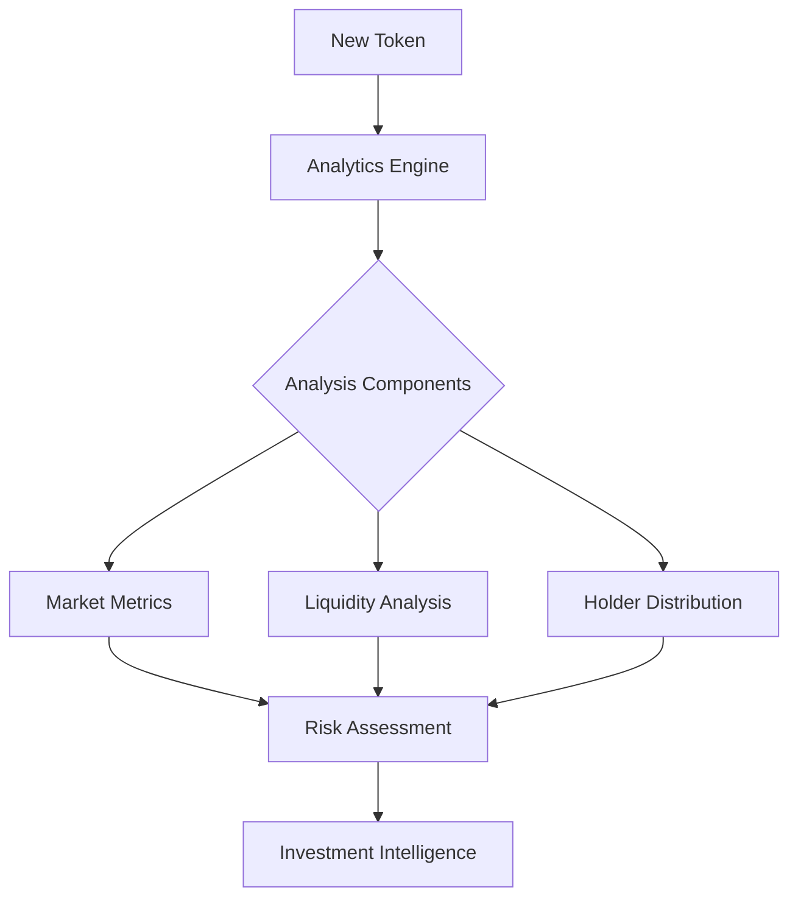
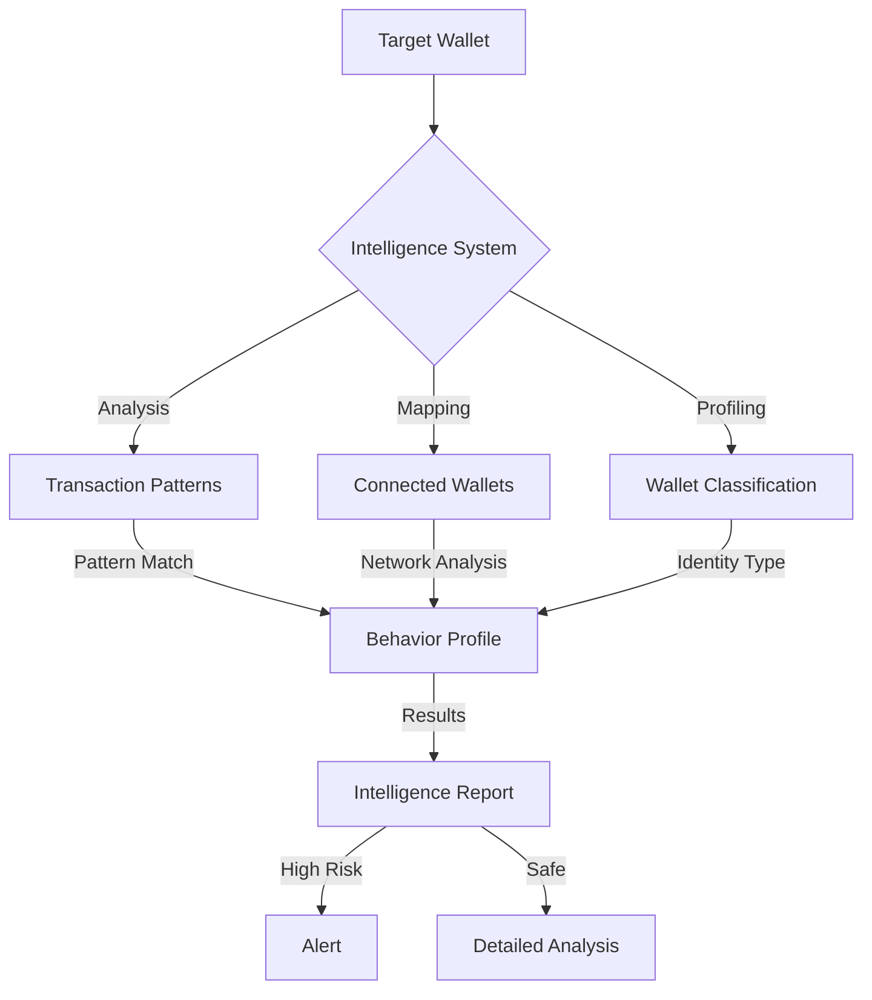
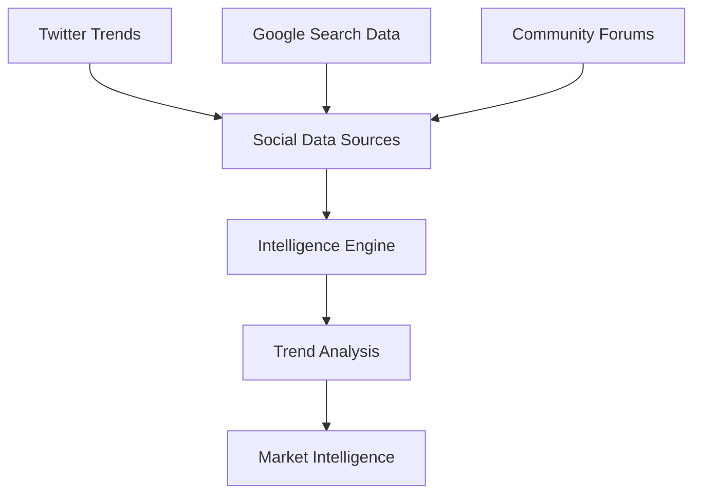

# QUANTANIUM: Advanced Blockchain Intelligence Platform for Retail Investors

[](https://quantanium.xyz)
[](https://quantanium.xyz)
[](https://quantanium.xyz)

<div align="center">
  
  
## Platform Information
**Network Support**: Solana </p>
**Launch Date**: 18th of Feb, 2025 </p>
**Website**: [quantanium.xyz](https://quantanium.xyz) </p>

  # Your Personal Blockchain Intelligence Suite
  
</div>

<div align="left">

## 🌟 The Power of Professional Analytics in Your Hands

Imagine having the same level of blockchain intelligence that institutional investors use, right in your browser. QUANTANIUM brings professional-grade analytics to retail investors, helping you make informed decisions based on real data, not just hype.

### 💡 Why Current Solutions Fall Short

Traditional Token Research:
- ❌ Limited access to wallet & token intelligence
- ❌ No insight into developer/team activities
- ❌ Missing connection between related wallets
- ❌ Delayed or incomplete market data

### 🧬 The QUANTANIUM Solution

Our platform provides comprehensive market intelligence through three core components: Token Analytics, Wallet Intelligence, and Market Research. Each component delivers:

- ✅ Real-time token metrics and market analysis
- ✅ Advanced wallet relationship mapping
- ✅ Team and insider wallet tracking
- ✅ Developer activity monitoring
- ✅ Connected wallet visualization

## The Intelligence System

### 1. Token Analytics Engine


Core Features:
- **Market Analysis**
  - Real-time price and volume tracking
  - Liquidity depth analysis
  - Holder distribution patterns
  - Trading volume analysis
  - Market manipulation detection

### 2. Wallet Intelligence (Coming Soon)


Key Features:
- Wallet relationship mapping
- Team wallet identification
- Developer fund tracking
- Insider trading detection
- Transaction pattern analysis

### 3. Social Intelligence Integration (Coming Soon)

- **Social Trend Analysis**
  - Twitter sentiment tracking
  - Trending topics monitoring
  - Community engagement metrics
  - Influencer activity tracking

- **Search Intelligence**
  - Google Trends integration
  - Meta shift detection - Displays trends for Meta Analysis.
  - Cross-platform correlation
  - Volume trend analysis

### 4. Market Research Hub (Coming Soon)
A comprehensive research platform providing:

| Analysis Type | Data Points | Insights Provided | Action Items |
|--------------|-------------|-------------------|--------------|
| Token Analysis | Market Metrics | Price/Volume Trends | Investment Signals |
| Team Analysis | Wallet Activities | Developer Behavior | Risk Assessment |
| Market Intelligence | Trading Patterns | Market Manipulation | Trading Opportunities |
| Network Analysis | Wallet Connections | Insider Activities | Risk Management |

## Quick Start Guide

### For Users
Get started with QUANTANIUM analytics in minutes:

1. **Access Analytics**
   ```bash
   # Input any token address
   Visit: https://quantanium.xyz/token-verifier
   ```

2. **Install the Extension**
   ```bash
   # Chrome Web Store (Coming Soon)
   ```

### Beta Program Benefits

During the beta phase, you'll receive:
- Early access to all features
- If you registered for the Airdrop, You'll receive FREE LIFETIME BASIC ACCESS post beta

### Beta Access Program

Access to the Quantanium beta is provided through our exclusive NFT Access Key system.

The NFT Access Key is a unique token that grants access to the Quantanium.

Once the Beta Phase is concluded, the cost of the Access Key will be 250,000 $QNTM Tokens. 

| Feature | Details |
|---------|---------|
| Format | NFT Airdrop |
| Cost | 250,000 tokens |
| Rewards | Fee Rewards for Holders |
| Duration | Lifetime access |
---

| Allocation | Percentage | Amount | Vesting |
|------------|------------|---------|---------|
| Staking & Revenue Share | 25% | 250,000,000 | Immediate |
| Development Fund & Team | 15% | 150,000,000 | 3-month linear vesting |
| PumpFun Launch | 60% | 600,000,000 | Immediate circulating supply |


*"Empowering retail investors with institutional-grade blockchain intelligence."*
