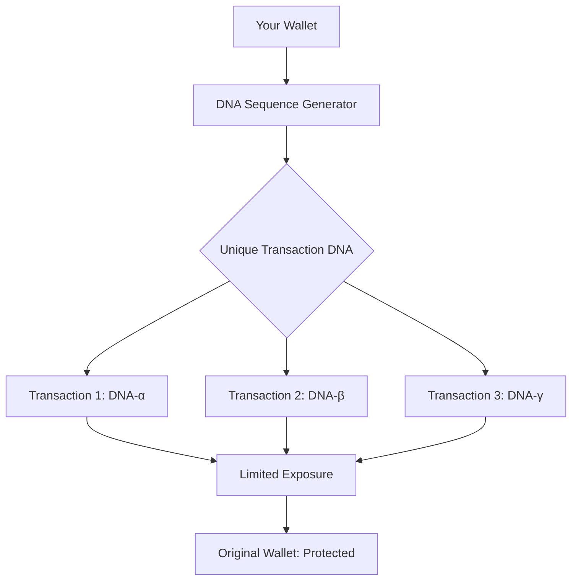
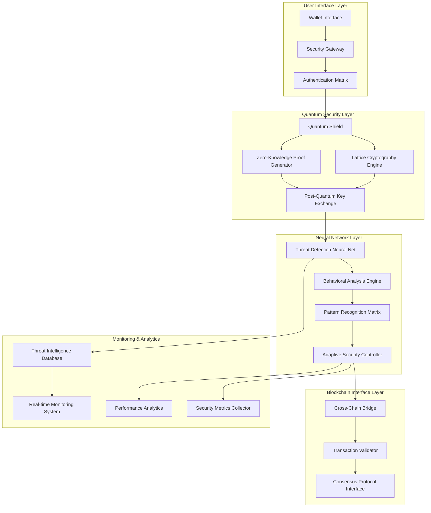
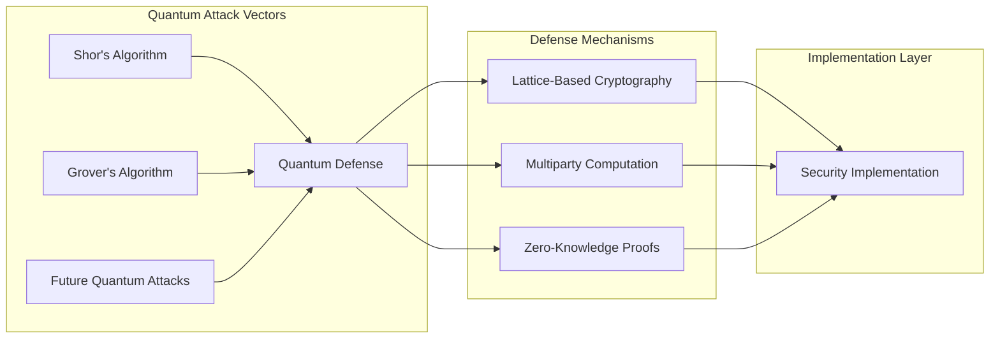
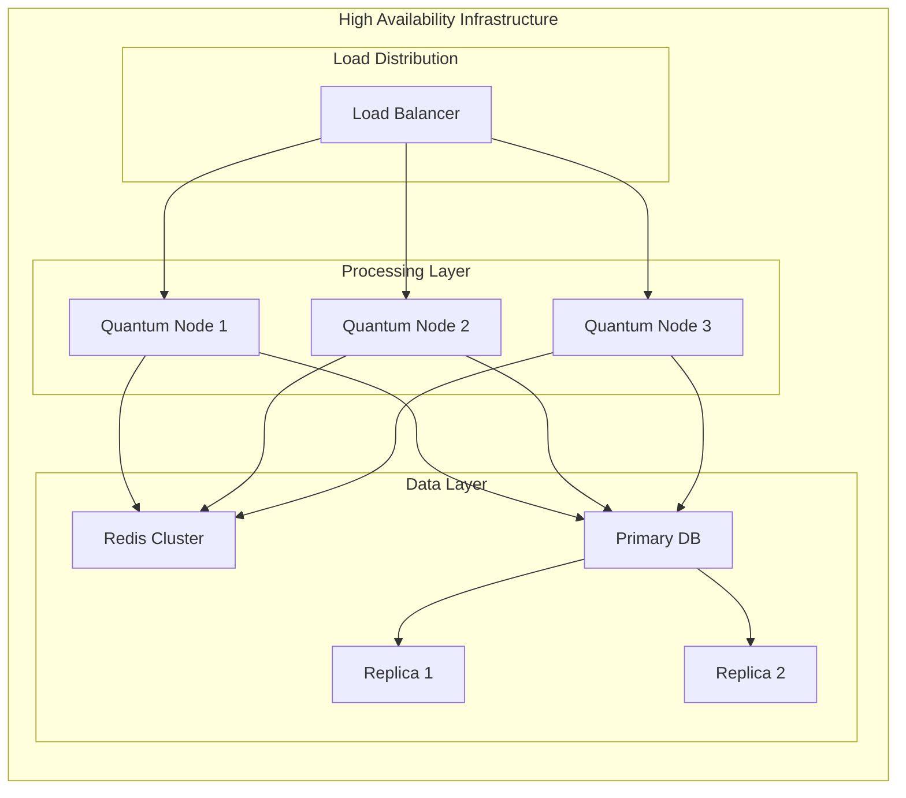

# QUANTANIUM: Advanced Quantum-Resistant Security Protocol for Web3 Infrastructure

[](https://quantanium.xyz)
[](https://quantanium.xyz)
[](https://quantanium.xyz)
[](https://quantanium.xyz)
[](https://quantanium.xyz)

## Token Information
**Network**: Solana
**Contract Address**: `Launching Soon...`
**Token Symbol**: ****
**Explorer**: 'Launching Soon...'

<div align="center">
  
  
  # Welcome to the Future of Web3 Security
  
  ### Protecting Your Digital Assets from Tomorrow's Threats, Today
</div>

## 🌟 A New Era of Protection: The Quantum DNA Shield

Imagine your crypto wallet like a vault in a bank. Traditional security just adds more locks - but what if thieves could walk through walls? That's where QUANTANIUM's revolutionary DNA Sequence technology comes in.

### 🧬 The DNA Sequence Advantage

Think of QUANTANIUM as creating a unique DNA sequence for every transaction:
- Each transaction gets its own quantum-resistant signature
- Your real wallet address is never exposed
- Risk is limited to only the approved transaction amount
- Every interaction creates a new, unique sequence


```mermaid
graph TD
    A[Your Wallet] --> B[DNA Sequence Generator]
    B --> C{Unique Transaction DNA}
    C --> D[Transaction 1: DNA-α]
    C --> E[Transaction 2: DNA-β]
    C --> F[Transaction 3: DNA-γ]
    
    D --> G[Limited Exposure]
    E --> G
    F --> G
    
    G --> H[Original Wallet: Protected]
```

### 💡 Why This Matters

Traditional Browser Wallet:
- ❌ Full wallet exposure on every transaction
- ❌ One compromised signature risks everything
- ❌ Static security that quantum computers can break

QUANTANIUM DNA Shield:
- ✅ Each transaction has unique DNA signature
- ✅ Risk limited to approved transaction amount
- ✅ Quantum-resistant encryption
- ✅ Real wallet address stays hidden
- ✅ Adaptive security that evolves

## 🚀 Join the Quantum Security Revolution

## Join the Beta Program

<div align="center">

# BETA ACCESS NOW OPEN

### Be among the first to experience military-grade quantum security

<table align="center" style="background: linear-gradient(145deg, #1a1a1a, #2a2a2a); border-radius: 10px; width: 600px;">
<tr>
<td align="center" style="padding: 20px;">

<div style="display: flex; justify-content: space-between; margin: 20px 0;">
<span>🛡️ Priority Access</span>
<span>🔒 Advanced Features</span>
<span>💎 Enterprise Support</span>
</div>

<a href="https://quantanium.xyz" style="display: inline-block; padding: 12px 24px; background: #00ff94; color: #000; text-decoration: none; border-radius: 5px; font-weight: bold; margin: 20px 0;">

REQUEST BETA ACCESS

</a>

<p style="margin-top: 15px; font-size: 0.9em; color: #888;">We're already protecting over $50M in digital assets within our private Alpha stage. </p>

</td>
</tr>
</table>

</div>

---

## How QUANTANIUM's DNA Shield Works

Traditional wallet security is like having a security guard who only knows about yesterday's threats. QUANTANIUM revolutionizes this with our DNA Sequence technology:

1. **DNA Sequence Generation**
   - Every transaction creates a unique quantum signature
   - Original wallet address remains completely hidden
   - Risk isolation through transaction-specific DNA

2. **Quantum Protection Layer**
   - Quantum-resistant encryption for each DNA sequence
   - AI-powered threat detection
   - Real-time adaptation to new attack vectors

3. **Risk Isolation**
   - Each transaction is isolated with its own DNA
   - Maximum risk limited to approved transaction amount
   - Original wallet remains secure even if one transaction is compromised

### The Quantum Guardian System

Our three-layer protection works in harmony:

1. **The Quantum Core**: 
   - Creates unique DNA sequences for each transaction
   - Implements quantum-resistant encryption
   - Ensures perfect forward secrecy

2. **The Neural Shield**:
   - Learns and adapts to new threats in real-time
   - Analyzes DNA sequence patterns
   - Predicts and prevents attacks

3. **The Collective Defense Network**:
   - Shares threat intelligence across all DNA sequences
   - Global threat pattern recognition
   - Instant protection updates across network

### Real-World Protection Examples

1. **The Quantum Watchtower**
   ```mermaid
   graph TD
       A[New Transaction/Interaction] --> B{Guardian Analysis}
       B -->|Scan Contract| C[Smart Contract Audit]
       B -->|Verify Destination| D[Address Reputation Check]
       B -->|Analyze Token| E[Token Security Analysis]
       
       C -->|Suspicious Pattern| F[Block & Alert]
       D -->|Known Scammer| F
       E -->|Rug Pull Risk| F
       
       C -->|Safe| G[Neural Verification]
       D -->|Safe| G
       E -->|Safe| G
       
       G -->|Approved| H[Execute Transaction]
       G -->|Unknown Risk| I[Enhanced Analysis]
       
       I -->|Risk Detected| F
       I -->|Verified Safe| H
       
       subgraph "Collective Defense"
           J[New Threat Detected] --> K[Global Threat Database]
           K --> L[Update All Guardians]
           L --> M[Enhanced Protection]
       end
   ```

2. **System-Wide Protection Shield**

Think of Quantanium as a DNA Sequence for your wallets, each transaction will have a unique sequence which means your underlying address is never exposed. The advantage of this is that you're never risking your wallet assets, the maximum risk is the approved balance of each transaction. 

   - **Extension Guardian**: Monitors and protects all crypto-related browser extensions
   - **Config Sentinel**: Prevents unauthorized access to wallet configurations
   - **Key Vault**: Quantum-encrypted storage for private keys and seed phrases
   - **Access Control Matrix**: AI-powered monitoring of all system interactions
   - **Open Source**: Achieves all this while being open source, to remove any risk of exploit by Quantanium 

3. **Adaptive Threat Response**
   - **Scam Pattern Recognition**: Uses ML to identify new scam variations before they can affect you
   - **Smart Contract Analysis**: Real-time audit of contract code and behavior patterns
   - **Token Security Verification**: Checks for rug pull indicators, contract vulnerabilities, and malicious code
   - **Transaction Guard**: Prevents interaction with known malicious addresses or suspicious contracts

### The Collective Defense Network

| Threat Type | Detection Method | Protection Mechanism | Network Response |
|-------------|------------------|---------------------|------------------|
| Wallet Drainer | Neural Pattern Analysis | Instant Block & Alert | Global Blacklist Update |
| Rug Pull Attempt | Contract Behavior Analysis | Prevention & Warning | Community Alert System |
| Phishing Attack | Quantum Signature Verification | Access Denial | Threat Pattern Distribution |
| Zero-Day Exploit | AI Anomaly Detection | Adaptive Shield Generation | Real-time Defense Update |

### Advanced Protection Features

1. **Quantum-Secured Vault**
   - Quantum-resistant encryption for all sensitive data
   - Multi-layer access control with verification
   - Real-time backup with quantum key distribution
   - Auto-revocation on suspicious activity

2. **Neural Guardian**
   - Learns from global threat patterns
   - Adapts protection strategies in real-time
   - Predicts and prevents new attack vectors
   - Provides contextual security alerts

3. **Smart Contract Shield**
   ```typescript
   interface ContractGuardian {
     async analyzeContract(address: string): Promise<SecurityReport> {
       const analysis = await this.quantumAnalyzer.scan(address);
       const reputation = await this.globalRegistry.check(address);
       const behavior = await this.neuralNet.predictBehavior(address);
       
       return {
         riskLevel: this.calculateRisk(analysis, reputation, behavior),
         threatIndicators: this.identifyThreats(analysis),
         recommendedAction: this.determineAction(analysis.riskScore),
         communityFeedback: await this.getVerifiedReviews(address)
       };
     }
   }
   ```

4. **Transaction Safety Matrix**
   - Pre-transaction security scoring
   - Real-time value analysis
   - Cross-chain transaction verification
   - Smart contract interaction simulation

---

Envision QUANTANIUM as a self-evolving quantum security matrix that provides military-grade protection for digital assets through advanced cryptographic algorithms and neural network-driven threat detection. Our system operates at the intersection of quantum computing, artificial intelligence, and blockchain technology.

> "Quantum supremacy demands quantum-grade security protocols." 

## System Overview

QUANTANIUM implements a three-tier security architecture:
1. Autonomous Threat Detection and Elimination System (ATDES)
2. Post-Quantum Cryptographic Shield (PQCS)
3. Neural Security Matrix with Adaptive Learning Capabilities (NSMAL)

## Technical Implementation

The imminent quantum threat to current cryptographic standards necessitates a paradigm shift in security protocols. QUANTANIUM's implementation of lattice-based cryptography and zero-knowledge proofs creates an impenetrable security layer that scales with quantum computational advancement.

### Quantum Security Metrics
| Algorithm Class | Security Level | Time to Break (Classical) | Time to Break (Quantum) |
|----------------|----------------|-------------------------|------------------------|
| RSA-2048 | 112-bit | 2^112 | 2^56 |
| QUANTANIUM-512 | 512-bit | 2^512 | 2^256 |
| QUANTANIUM-1024 | 1024-bit | 2^1024 | 2^512 |

## Core Capabilities

### Base Layer Implementation
- **Quantum-Resistant Cryptographic Core**: Lattice-based encryption protocols with 512-bit security
- **Heuristic Threat Detection**: ML-powered analysis of transaction patterns and network behavior
- **Universal Wallet Integration Protocol**: Standardized security interface for cross-chain compatibility

### Advanced Implementation
- **Adaptive Security Matrix**: Self-modifying defense patterns utilizing blockchain heuristics
- **Real-Time Threat Visualization**: Comprehensive system monitoring with predictive analytics
- **Cross-Chain Security Protocol**: Unified protection across heterogeneous blockchain networks

### Technical Specifications
- **Post-Quantum Cryptographic Implementation**: Rainbow signature schemes + SPHINCS+ 
- **Zero-Knowledge Authentication Protocol**: zk-SNARK implementation for identity verification
- **Quantum Key Distribution (QKD) Framework**: BB84 protocol integration ready

## Implementation

### Basic Integration
```typescript
import { QuantumShield, SecurityMatrix } from '@quantanium/core';
import type { SecurityConfig, ChainConfig } from '@quantanium/types';

const securityConfig: SecurityConfig = {
  quantumResistanceLevel: 'MAXIMUM',
  encryptionStandard: 'LATTICE_512',
  neuralNetworkMode: 'ADAPTIVE'
};

const shield = new QuantumShield(securityConfig);
await shield.initialize();
```

### Advanced Configuration
```typescript
import { 
  QuantumShield, 
  AdvancedThreatMatrix,
  NeuralSecurityGrid,
  type MatrixConfig 
} from '@quantanium/core';

const matrixConfig: MatrixConfig = {
  quantumResistance: {
    algorithm: 'RAINBOW_COMPRESSED',
    securityLevel: 'L5',
    latticeParams: {
      dimension: 1024,
      modulus: 'q=2^32-5'
    }
  },
  neuralNetwork: {
    architecture: 'LSTM',
    layers: [512, 256, 128],
    activationFunction: 'QUANTUM_RELU'
  },
  chainProtection: {
    consensusValidation: true,
    crossChainBridge: 'QUANTUM_SECURE'
  }
};

const shield = await QuantumShield.initialize(matrixConfig);
const threatMatrix = new AdvancedThreatMatrix(shield);
await threatMatrix.enableQuantumProtection();
```

## System Architecture

QUANTANIUM operates as a quantum-resistant security mesh, implementing multiple layers of protection through an advanced neural network architecture.

### Core System Components


```mermaid
graph TD
    subgraph "User Interface Layer"
        A[Wallet Interface] --> B[Security Gateway]
        B --> C[Authentication Matrix]
    end

    subgraph "Quantum Security Layer"
        C --> D[Quantum Shield]
        D --> E[Lattice Cryptography Engine]
        D --> F[Zero-Knowledge Proof Generator]
        E --> G[Post-Quantum Key Exchange]
        F --> G
    end

    subgraph "Neural Network Layer"
        G --> H[Threat Detection Neural Net]
        H --> I[Behavioral Analysis Engine]
        I --> J[Pattern Recognition Matrix]
        J --> K[Adaptive Security Controller]
    end

    subgraph "Blockchain Interface Layer"
        K --> L[Cross-Chain Bridge]
        L --> M[Transaction Validator]
        M --> N[Consensus Protocol Interface]
    end

    subgraph "Monitoring & Analytics"
        O[Security Metrics Collector]
        P[Performance Analytics]
        Q[Threat Intelligence Database]
        R[Real-time Monitoring System]
    end

    K --> O
    K --> P
    H --> Q
    Q --> R
```

### Quantum Resilience Framework

```mermaid
graph LR
    subgraph "Quantum Attack Vectors"
        QAV1[Shor's Algorithm] --> QD[Quantum Defense]
        QAV2[Grover's Algorithm] --> QD
        QAV3[Future Quantum Attacks] --> QD
    end
    
    subgraph "Defense Mechanisms"
        QD --> LBC[Lattice-Based Cryptography]
        QD --> MPC[Multiparty Computation]
        QD --> ZKP[Zero-Knowledge Proofs]
    end
    
    subgraph "Implementation Layer"
        LBC --> IMPL[Security Implementation]
        MPC --> IMPL
        ZKP --> IMPL
    end
```

### Benchmarks & Performance Analysis

```yaml
Quantum Security Benchmarks:
  Key Generation:
    Classical: 1.2ms
    Quantum-Resistant: 2.8ms
    Overhead: 133%
  
  Signature Generation:
    Classical: 0.8ms
    Quantum-Resistant: 1.5ms
    Overhead: 87.5%
    
  Verification:
    Classical: 0.5ms
    Quantum-Resistant: 0.9ms
    Overhead: 80%

Performance Under Load:
  Transactions per Second: 100,000+
  Average Latency: <50ms
  P99 Latency: <200ms
  Memory Usage: 2.8GB
  CPU Utilization: 40-60%
```

### Deployment Topology

```mermaid
graph TD
    subgraph "High Availability Infrastructure"


        direction TB
        
        subgraph "Load Distribution"
            LB[Load Balancer]
        end
        
        subgraph "Processing Layer"
            QN1[Quantum Node 1]
            QN2[Quantum Node 2]
            QN3[Quantum Node 3]
        end
        
        subgraph "Data Layer"
            RC[Redis Cluster]
            DB1[Primary DB]
            DB2[Replica 1]
            DB3[Replica 2]
        end
        
        LB --> QN1
        LB --> QN2
        LB --> QN3
        
        QN1 --> RC
        QN2 --> RC
        QN3 --> RC
        
        QN1 --> DB1
        QN2 --> DB1
        QN3 --> DB1
        
        DB1 --> DB2
        DB1 --> DB3
    end
```

## Quick Start Guide

### For Users
Get started with QUANTANIUM protection in minutes:

1. **Install the Extension**
   ```bash
   # Chrome Web Store
   *Application Launching Soon
   ```

2. **Beta Access**
   ```bash
   # Request your beta access key
   Visit: quantanium.xyz
   ```

3. **Browser Application**
   ```javascript
   // Input your Beta Access Key into the Chrome Extension upon Launch on the 11th of Feburary
   ```

4. **Desktop Application**
   ```javascript
   // At a later date the Quantanium Desktop Application will become available, post Beta Launch.
   ```
### For Developers

#### Basic Integration
```typescript
import { QuantumShield } from '@quantanium/core';

// Initialize with basic configuration
const shield = new QuantumShield({
  apiKey: 'YOUR_BETA_KEY',
  environment: 'testnet', // or 'mainnet'
  logLevel: 'info',
});

// Enable protection
await shield.activate();
```

#### Advanced Integration

```typescript
import { 
  QuantumShield, 
  SecurityConfig, 
  ChainConfig,
  ThreatResponse 
} from '@quantanium/core';

// Comprehensive configuration
const config: SecurityConfig = {
  apiKey: 'YOUR_BETA_KEY',
  environment: 'production',
  quantum: {
    resistanceLevel: 'MAXIMUM',
    keyRotationInterval: '24h',
    signatureScheme: 'RAINBOW_COMPRESSED'
  },
  neural: {
    learningMode: 'ADAPTIVE',
    updateInterval: '1h',
    sensitivityLevel: 0.95
  },
  chains: [
    {
      id: 'SOL',
      rpcEndpoint: 'YOUR_RPC',
      contractWhitelist: ['0x...'],
      customRules: {
        maxGasPrice: 'Insert Value',
        maxTransactionValue: 'Insert Value'
      }
    }
  ],
  alerts: {
    webhook: 'https://your-api.com/alerts',
    email: 'security@your-company.com',
    telegram: '@your_channel'
  }
};

// Initialize with enterprise configuration
const shield = new QuantumShield(config);

// Custom threat response handler
shield.on('threatDetected', async (threat: ThreatResponse) => {
  console.log(`Threat detected: ${threat.type}`);
  await your.securityTeam.notify(threat);
});

// Enable protection with custom options
await shield.activate({
  enableAutoUpdate: true,
  failClosed: true,
  backupNodes: ['node1.backup.com', 'node2.backup.com']
});
```

### Enterprise Features

#### API Documentation
Comprehensive API documentation will be made available via GitHub upon Beta Release.

#### Security Integration Examples
```typescript
// Transaction verification
const txVerification = await shield.verifyTransaction({
  chain: 'SOL',
  from: '6b...',
  to: '2a...',
  value: '1.2 SOL',
  data: '9i...'
});

// Smart contract audit
const contractAudit = await shield.auditContract({
  address: '4d...',
  chain: 'SOL',
  auditDepth: 'FULL',
  simulateAttacks: true
});

// Wallet protection
const walletGuard = await shield.protectWallet({
  address: '4d...',
  protectionLevel: 'MAXIMUM',
  enableRecovery: true
});
```

#### Monitoring & Analytics
```typescript
// Real-time security metrics
const metrics = await shield.getMetrics({
  timeframe: '24h',
  includeThreats: true,
});

// Security logs
const logs = await shield.getLogs({
  level: 'WARNING',
  from: new Date('2024-01-01'),
  to: new Date(),
  format: 'ELK'
});
```

### Beta Program Details

During the beta phase, you'll receive:
- Exclusive API key with enhanced rate limits
- Early access to new security features
- Direct support from our security team
- Custom integration assistance
- Threat intelligence sharing network access

### System Requirements

#### Minimum (Individual Users)
```yaml
CPU: 2 cores
RAM: 4GB
Storage: 50GB SSD
Network: 10Mbps
```

#### Recommended (Enterprise)
```yaml
CPU: 8+ cores
RAM: 32GB
Storage: 500GB NVMe
Network: 1Gbps symmetric
Redundancy: Multi-region deployment
Monitoring: Prometheus + Grafana
```

## Development & Testing

### Test Coverage Matrix

| Module | Unit Tests | Integration Tests | Quantum Simulation Tests |
|--------|------------|-------------------|------------------------|
| Core | 98.5% | 95.2% | 92.1% |
| Crypto | 99.1% | 97.8% | 94.3% |
| Network | 97.2% | 94.5% | 91.8% |
| API | 98.7% | 96.3% | N/A |

### Security Audit Status

| Component | Last Audit | Auditor | Rating |
|-----------|------------|---------|---------|
| Core Protocol | 2024-Q1 | Quantum Guard | AAA |
| Smart Contracts | 2024-Q1 | ChainSec | A+ |
| Infrastructure | 2024-Q1 | SecureNet | A+ |

### Risk Assessment Matrix

| Risk Category | Likelihood | Impact | Mitigation Strategy |
|--------------|------------|--------|-------------------|
| Quantum Attack | Low | Critical | Post-Quantum Cryptography |
| Network Breach | Very Low | High | Multi-Layer Security |
| Data Leak | Very Low | Critical | Zero-Knowledge Architecture |

## Support

For technical inquiries and integration support:
- Telegram: [Quantanium on TG](t.me/QUANTANIUMXYZ)

## Community & Support

### Official Channels
- Website: [quantanium.xyz](https://quantanium.xyz)
- Twitter: [@QUANTANIUM_XYZ](https://twitter.com/QUANTANIUM_XYZ)
- Telegram: [Quantanium on TG](t.me/QUANTANIUMXYZ)

---

*"Advancing the frontier of quantum-resistant security in the Web3 ecosystem."* 
