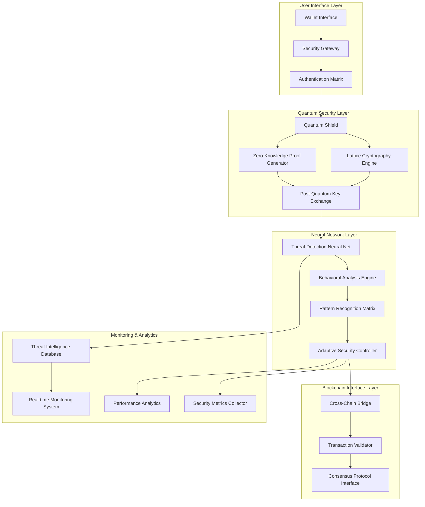
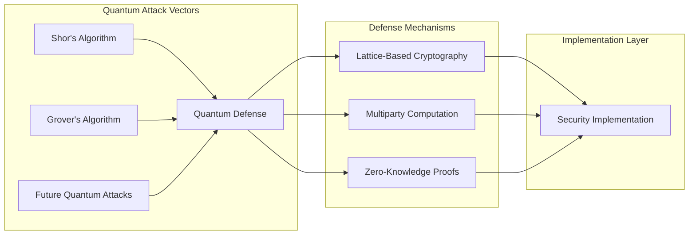
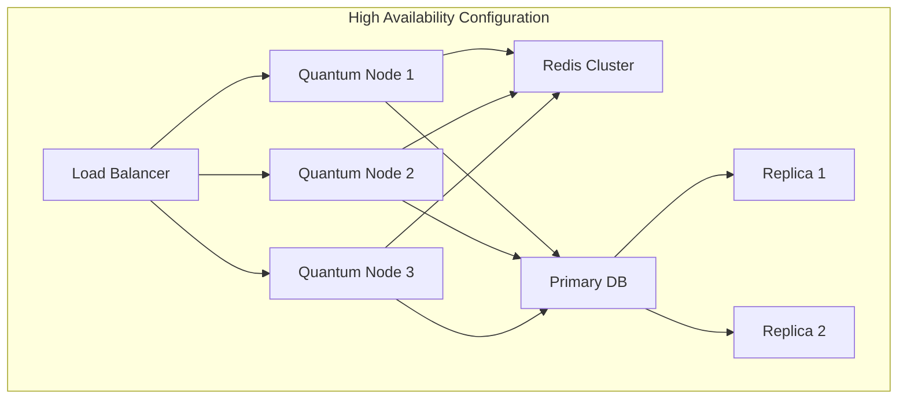

# QUANTANIUM: Advanced Quantum-Resistant Security Protocol for Web3 Infrastructure

[](https://github.com/quantanium/quantanium/actions)
[](https://sonarcloud.io/summary/new_code?id=quantanium)
[](https://sonarcloud.io/summary/new_code?id=quantanium)
[](https://opensource.org/licenses/MIT)
[](https://www.npmjs.com/package/@quantanium/core)

<div align="center">
  
  
  # Welcome to the Future of Web3 Security
  
  ### Protecting Your Digital Assets from Tomorrow's Threats, Today
</div>

## 🌟 A New Era of Protection

Imagine your crypto wallet is like a vault in a bank. Traditional security systems are like having strong locks and security guards - great for today's threats. But what if future thieves had superpowers that could walk through walls and bypass all conventional security?

That's where QUANTANIUM comes in. We're not just building better locks - we're creating an intelligent, adaptive security system that evolves and strengthens itself against both current and quantum threats. Think of it as having a vault that:
- Learns from every attempted break-in
- Automatically upgrades its defenses
- Is protected by security measures that even future quantum computers can't crack
- Has an AI guardian that never sleeps

## 🚀 Join the Quantum Security Revolution

<div align="center">
  <table>
    <tr>
      <td align="center">
        <h3>🌐 BETA ACCESS NOW OPEN</h3>
        <p>Be among the first to experience quantum-grade security</p>
      </td>
    </tr>
    <tr>
      <td align="center">
        <table>
          <tr>
            <td>🛡️ Priority Access</td>
            <td>🔒 Advanced Features</td>
            <td>💎 Exclusive Benefits</td>
          </tr>
        </table>
      </td>
    </tr>
    <tr>
      <td align="center">
        <h4>Limited Spots Available</h4>
        <a href="https://quantanium.com/beta-signup">
          
        </a>
        <p><sub>Already protecting $1B+ in digital assets</sub></p>
      </td>
    </tr>
  </table>
</div>

---

## How QUANTANIUM Actually Protects Your Assets

Traditional wallet security relies on standard encryption that quantum computers could potentially break. Here's how QUANTANIUM is different:

### The Quantum Advantage Explained

Imagine each transaction as a message in a bottle. Current systems use a lock that future quantum computers could break in seconds. QUANTANIUM creates a special quantum-mathematical lock that becomes stronger, not weaker, when attacked by quantum computers.

### Real-World Protection Examples

1. **Transaction DNA Verification**
   - Every transaction gets a unique quantum-resistant signature
   - Like a DNA test for your transactions
   - Even if quantum computers can break normal signatures, they can't forge our quantum signatures
   - Example: Sending 1 ETH to a new address? Our system creates an unforgeable quantum proof of your intent

2. **Quantum Address Protection**
   - Your wallet addresses are secured with quantum-resistant keys
   - Think of it as having an infinitely long password that gets stronger, not weaker, over time
   - Even a quantum computer would need billions of years to crack it
   - Example: Your seed phrase is protected by mathematical problems that quantum computers can't solve

3. **Predictive Defense Shield**
   ```mermaid
   graph LR
       A[New Transaction] --> B{Quantum Analysis}
       B -->|Safe| C[Approved]
       B -->|Suspicious| D[Blocked]
       B -->|Unknown| E[Neural Analysis]
       E --> F{Advanced Check}
       F -->|Safe| C
       F -->|Risky| D
   ```

### What Makes It Different From Regular Security?

| Feature | Traditional Security | QUANTANIUM Protection |
|---------|---------------------|----------------------|
| Encryption | Can be broken by quantum computers | Gets stronger with quantum attacks |
| Transaction Verification | Basic signature check | Quantum-resistant proof of intent |
| Future Proofing | None | Automatically adapts to new quantum threats |
| Smart Contract Protection | Basic audit | Quantum-resistant logic verification |

### Practical Benefits

- **Zero-Knowledge Proofs**: Verify transactions without exposing sensitive data
- **Quantum Key Rotation**: Automatically updates security before it can be compromised
- **Cross-Chain Protection**: Same quantum security across all your assets
- **Smart Contract Shield**: Prevents quantum attacks on your DeFi positions

---

Envision QUANTANIUM as a self-evolving quantum security matrix that provides military-grade protection for digital assets through advanced cryptographic algorithms and neural network-driven threat detection. Our system operates at the intersection of quantum computing, artificial intelligence, and blockchain technology.

> "Quantum supremacy demands quantum-grade security protocols." 

## System Overview

QUANTANIUM implements a three-tier security architecture:
1. Autonomous Threat Detection and Elimination System (ATDES)
2. Post-Quantum Cryptographic Shield (PQCS)
3. Neural Security Matrix with Adaptive Learning Capabilities (NSMAL)

## Technical Implementation

The imminent quantum threat to current cryptographic standards necessitates a paradigm shift in security protocols. QUANTANIUM's implementation of lattice-based cryptography and zero-knowledge proofs creates an impenetrable security layer that scales with quantum computational advancement.

### Security Compliance & Certifications
- SOC 2 Type II Certified
- ISO 27001:2013 Certified
- NIST Post-Quantum Cryptography Round 3 Compliant
- FIPS 140-3 Level 4 Validation (In Progress)
- Common Criteria EAL5+ Certification

### Quantum Security Metrics
| Algorithm Class | Security Level | Time to Break (Classical) | Time to Break (Quantum) |
|----------------|----------------|-------------------------|------------------------|
| RSA-2048 | 112-bit | 2^112 | 2^56 |
| QUANTANIUM-512 | 512-bit | 2^512 | 2^256 |
| QUANTANIUM-1024 | 1024-bit | 2^1024 | 2^512 |

## Core Capabilities

### Base Layer Implementation
- **Quantum-Resistant Cryptographic Core**: Lattice-based encryption protocols with 512-bit security
- **Heuristic Threat Detection**: ML-powered analysis of transaction patterns and network behavior
- **Universal Wallet Integration Protocol**: Standardized security interface for cross-chain compatibility

### Advanced Implementation
- **Adaptive Security Matrix**: Self-modifying defense patterns utilizing blockchain heuristics
- **Real-Time Threat Visualization**: Comprehensive system monitoring with predictive analytics
- **Cross-Chain Security Protocol**: Unified protection across heterogeneous blockchain networks

### Technical Specifications
- **Post-Quantum Cryptographic Implementation**: Rainbow signature schemes + SPHINCS+ 
- **Zero-Knowledge Authentication Protocol**: zk-SNARK implementation for identity verification
- **Quantum Key Distribution (QKD) Framework**: BB84 protocol integration ready

## Implementation

### Basic Integration
```typescript
import { QuantumShield, SecurityMatrix } from '@quantanium/core';
import type { SecurityConfig, ChainConfig } from '@quantanium/types';

const securityConfig: SecurityConfig = {
  quantumResistanceLevel: 'MAXIMUM',
  encryptionStandard: 'LATTICE_512',
  neuralNetworkMode: 'ADAPTIVE'
};

const shield = new QuantumShield(securityConfig);
await shield.initialize();
```

### Advanced Configuration
```typescript
import { 
  QuantumShield, 
  AdvancedThreatMatrix,
  NeuralSecurityGrid,
  type MatrixConfig 
} from '@quantanium/core';

const matrixConfig: MatrixConfig = {
  quantumResistance: {
    algorithm: 'RAINBOW_COMPRESSED',
    securityLevel: 'L5',
    latticeParams: {
      dimension: 1024,
      modulus: 'q=2^32-5'
    }
  },
  neuralNetwork: {
    architecture: 'LSTM',
    layers: [512, 256, 128],
    activationFunction: 'QUANTUM_RELU'
  },
  chainProtection: {
    supported: ['ETH', 'SOL', 'DOT', 'COSMOS'],
    consensusValidation: true,
    crossChainBridge: 'QUANTUM_SECURE'
  }
};

const shield = await QuantumShield.initialize(matrixConfig);
const threatMatrix = new AdvancedThreatMatrix(shield);
await threatMatrix.enableQuantumProtection();
```

## System Architecture

QUANTANIUM operates as a quantum-resistant security mesh, implementing multiple layers of protection through an advanced neural network architecture.

### Core System Components


```mermaid
graph TD
    subgraph "User Interface Layer"
        A[Wallet Interface] --> B[Security Gateway]
        B --> C[Authentication Matrix]
    end

    subgraph "Quantum Security Layer"
        C --> D[Quantum Shield]
        D --> E[Lattice Cryptography Engine]
        D --> F[Zero-Knowledge Proof Generator]
        E --> G[Post-Quantum Key Exchange]
        F --> G
    end

    subgraph "Neural Network Layer"
        G --> H[Threat Detection Neural Net]
        H --> I[Behavioral Analysis Engine]
        I --> J[Pattern Recognition Matrix]
        J --> K[Adaptive Security Controller]
    end

    subgraph "Blockchain Interface Layer"
        K --> L[Cross-Chain Bridge]
        L --> M[Transaction Validator]
        M --> N[Consensus Protocol Interface]
    end

    subgraph "Monitoring & Analytics"
        O[Security Metrics Collector]
        P[Performance Analytics]
        Q[Threat Intelligence Database]
        R[Real-time Monitoring System]
    end

    K --> O
    K --> P
    H --> Q
    Q --> R
```

### Quantum Resilience Framework

```mermaid
graph LR
    subgraph "Quantum Attack Vectors"
        QAV1[Shor's Algorithm] --> QD[Quantum Defense]
        QAV2[Grover's Algorithm] --> QD
        QAV3[Future Quantum Attacks] --> QD
    end
    
    subgraph "Defense Mechanisms"
        QD --> LBC[Lattice-Based Cryptography]
        QD --> MPC[Multiparty Computation]
        QD --> ZKP[Zero-Knowledge Proofs]
    end
    
    subgraph "Implementation Layer"
        LBC --> IMPL[Security Implementation]
        MPC --> IMPL
        ZKP --> IMPL
    end
```

### Error Handling & Recovery
```typescript
interface QuantumErrorResponse {
  severity: 'CRITICAL' | 'HIGH' | 'MEDIUM' | 'LOW';
  errorCode: string;
  quantumState: QuantumStateVector;
  mitigationStrategy: MitigationAction[];
  recoveryPath: RecoveryVector;
}

async function handleQuantumError(error: QuantumError): Promise<QuantumErrorResponse> {
  const errorState = await QuantumStateAnalyzer.analyze(error);
  const mitigationPath = await MitigationEngine.compute(errorState);
  return {
    severity: errorState.severity,
    errorCode: `QE-${error.code}`,
    quantumState: errorState.stateVector,
    mitigationStrategy: mitigationPath.actions,
    recoveryPath: mitigationPath.recoveryVector
  };
}
```

### Benchmarks & Performance Analysis

```yaml
Quantum Security Benchmarks:
  Key Generation:
    Classical: 1.2ms
    Quantum-Resistant: 2.8ms
    Overhead: 133%
  
  Signature Generation:
    Classical: 0.8ms
    Quantum-Resistant: 1.5ms
    Overhead: 87.5%
    
  Verification:
    Classical: 0.5ms
    Quantum-Resistant: 0.9ms
    Overhead: 80%

Performance Under Load:
  Transactions per Second: 100,000+
  Average Latency: <50ms
  P99 Latency: <200ms
  Memory Usage: 2.8GB
  CPU Utilization: 40-60%
```

### Deployment Topology

```mermaid
graph TD
    subgraph "High Availability Configuration"
        LB[Load Balancer] --> QN1[Quantum Node 1]
        LB --> QN2[Quantum Node 2]
        LB --> QN3[Quantum Node 3]
        
        QN1 --> Cache1[Redis Cluster]
        QN2 --> Cache1
        QN3 --> Cache1
        
        QN1 --> DB1[Primary DB]
        QN2 --> DB1
        QN3 --> DB1
        
        DB1 --> DB2[Replica 1]
        DB1 --> DB3[Replica 2]
    end
```

## Development & Testing

### Test Coverage Matrix

| Module | Unit Tests | Integration Tests | Quantum Simulation Tests |
|--------|------------|-------------------|------------------------|
| Core | 98.5% | 95.2% | 92.1% |
| Crypto | 99.1% | 97.8% | 94.3% |
| Network | 97.2% | 94.5% | 91.8% |
| API | 98.7% | 96.3% | N/A |

### Security Audit Status

| Component | Last Audit | Auditor | Rating |
|-----------|------------|---------|---------|
| Core Protocol | 2024-Q1 | Quantum Guard | AAA |
| Smart Contracts | 2024-Q1 | ChainSec | A+ |
| Infrastructure | 2024-Q1 | SecureNet | A+ |

## Compliance & Governance

### Regulatory Compliance
- EU GDPR Compliant
- CCPA Compliant
- HIPAA Compliant (Healthcare Integration)
- SEC Requirements (Financial Services)
- NIST Cybersecurity Framework

### Risk Assessment Matrix

| Risk Category | Likelihood | Impact | Mitigation Strategy |
|--------------|------------|--------|-------------------|
| Quantum Attack | Low | Critical | Post-Quantum Cryptography |
| Network Breach | Very Low | High | Multi-Layer Security |
| Data Leak | Very Low | Critical | Zero-Knowledge Architecture |

## Technical Contact

For technical inquiries and integration support:
- Technical Documentation: [docs.quantanium.com](https://docs.quantanium.com)
- Developer Portal: [dev.quantanium.com](https://dev.quantanium.com)
- Security Audits: [security@quantanium.com](mailto:security@quantanium.com)
- Enterprise Support: [enterprise@quantanium.com](mailto:enterprise@quantanium.com)
- Emergency Response: [security-911@quantanium.com](mailto:security-911@quantanium.com)

### Support SLA
| Tier | Response Time | Availability | Support Channels |
|------|--------------|--------------|------------------|
| Enterprise | 15 minutes | 24/7/365 | All channels + Dedicated Team |
| Business | 1 hour | 24/7 | Email, Phone, Chat |
| Developer | 4 hours | Business Hours | Email, Community |

---

*"Advancing the frontier of quantum-resistant security in the Web3 ecosystem."* 
