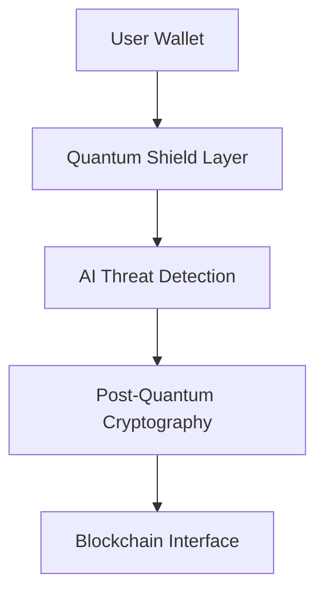

# QUANTANIUM: Your Wallet's Guardian in the Quantum Age

Imagine your crypto wallet as a digital fortress, and QUANTANIUM as an ever-evolving, intelligent shield that adapts and strengthens itself against both today's threats and tomorrow's quantum storms. We're not just another security tool – we're your wallet's living, breathing guardian in the Web3 universe.

> "The best defense of tomorrow requires quantum innovation today." 

## 🌟 Overview

Think of QUANTANIUM as having three layers of protection:
1. A vigilant guardian that spots and blocks scammers (like a really smart bouncer)
2. A quantum shield that evolves to protect against future super-computers
3. An intelligent system that learns and adapts to new threats (like an immune system for your digital assets)

## 🎯 Why QUANTANIUM?

Picture this: In the next few years, quantum computers will become powerful enough to break today's encryption – like using a sledgehammer to crack a regular padlock. Most wallets are still using that padlock, but QUANTANIUM users? They're already in a quantum-reinforced vault.

## ✨ Features

### For Everyone
- 🛡️ **Quantum Shield**: Like having a force field that even future supercomputers can't penetrate
- 🔍 **Scam Detector**: Think of it as a BS detector for crypto - spots fake websites and scam attempts before they reach you
- 🤝 **Wallet Buddy**: Works smoothly with MetaMask, Trust Wallet, and others (like having a universal adapter)

### For Power Users
- 🧬 **Adaptive Security Matrix**: Self-evolving defense patterns based on global threat analysis
- 📊 **Real-Time Threat Dashboard**: Visual insights into attack attempts and system performance
- 🔄 **Cross-Chain Protection**: Unified security across multiple blockchain ecosystems

### For Tech Enthusiasts
- 🌐 **Post-Quantum Cryptographic Protocols**: Implements lattice-based cryptography resistant to Shor's algorithm
- 🧮 **Zero-Knowledge Authentication**: Advanced identity verification without exposing sensitive data
- 🔐 **Quantum Key Distribution (QKD) Ready**: Prepared for quantum network integration

## 🚀 Getting Started

### Quick Start (Simple as 1-2-3)
```bash
git clone https://github.com/jermwang/QUANTANIUM.git
cd QUANTANIUM
npm install && npm start
```

### Basic Integration
```javascript
import { QuantumShield } from 'quantanium';

// Initialize your quantum protection
const shield = new QuantumShield();
shield.activate();
```

### Advanced Configuration
```javascript
import { QuantumShield, AdvancedThreatMatrix } from 'quantanium';

const shield = new QuantumShield({
  quantumResistance: 'lattice-based',
  aiThreatDetection: true,
  crossChainProtection: ['ETH', 'SOL', 'DOT']
});

await shield.initializeSecurityMatrix();
```

## 🏗️ Architecture

QUANTANIUM operates like a living organism, constantly evolving to protect your digital assets:

### Core Systems
- **Quantum Nexus**: Our quantum-resistant algorithmic core
- **Neural Security Grid**: AI-powered threat detection network
- **Adaptive Defense Matrix**: Real-time security protocol evolution

### Technical Stack

```mermaid
graph TD
    A[User Wallet] --> B[Quantum Shield Layer]
    B --> C[AI Threat Detection]
    C --> D[Post-Quantum Cryptography]
    D --> E[Blockchain Interface]
```

## 🤝 Join the Revolution

Whether you're a quantum physicist, a security researcher, or just someone who wants to keep their crypto safe, there's a place for you in the QUANTANIUM community. Check out our [Contributing Guidelines](CONTRIBUTING.md).

## 📜 License

QUANTANIUM is protected under the MIT License. See [LICENSE](LICENSE) for details.

## 🌐 Connect With Us

Join the quantum security revolution:
- 📧 Email: future@quantanium.com
- 🎮 Discord: [Quantum Guardians Community](https://discord.gg/quantanium)
- 🐦 Twitter: [@QuantaniumSec](https://twitter.com/QuantaniumSec)

---

*"In the quantum age, security isn't just a feature – it's a living, breathing shield."* 🌌
