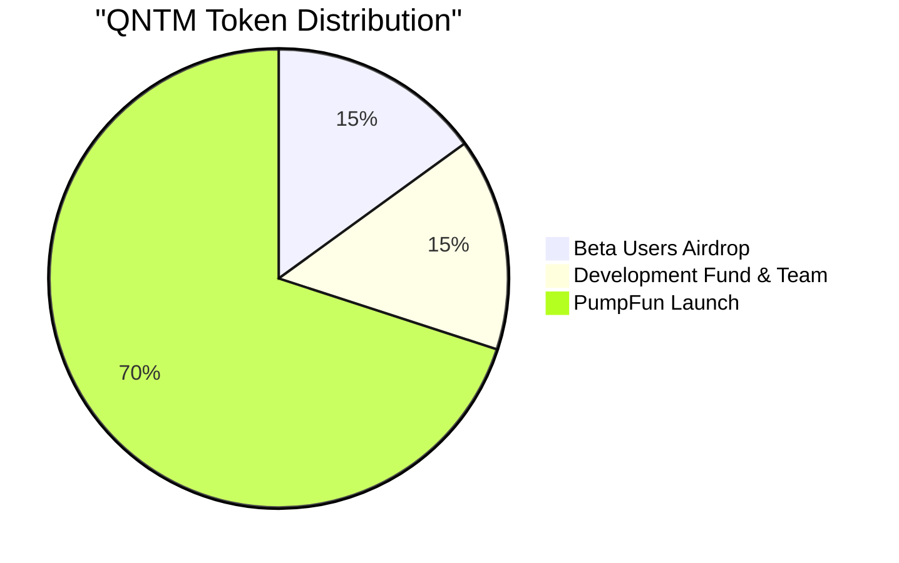
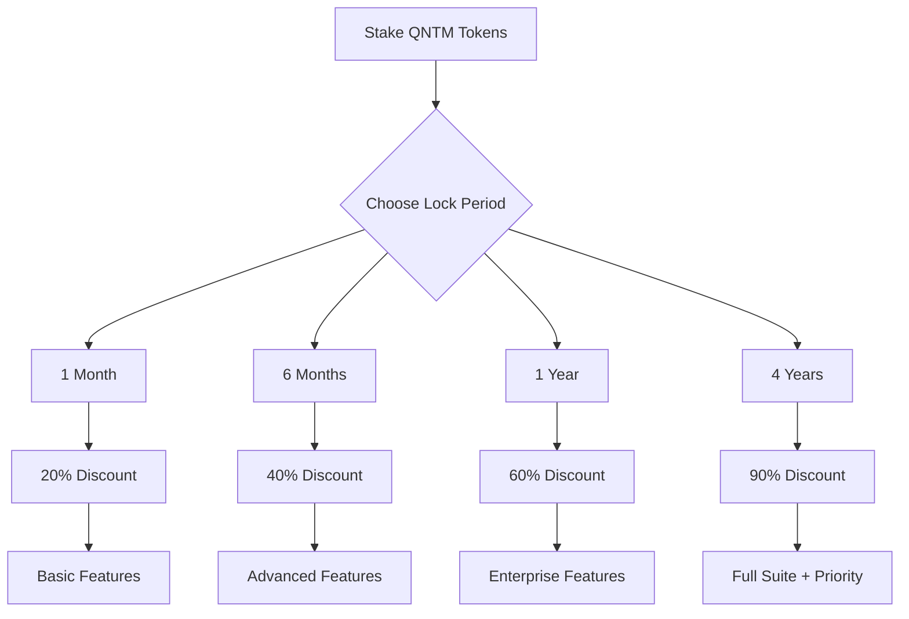
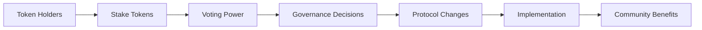
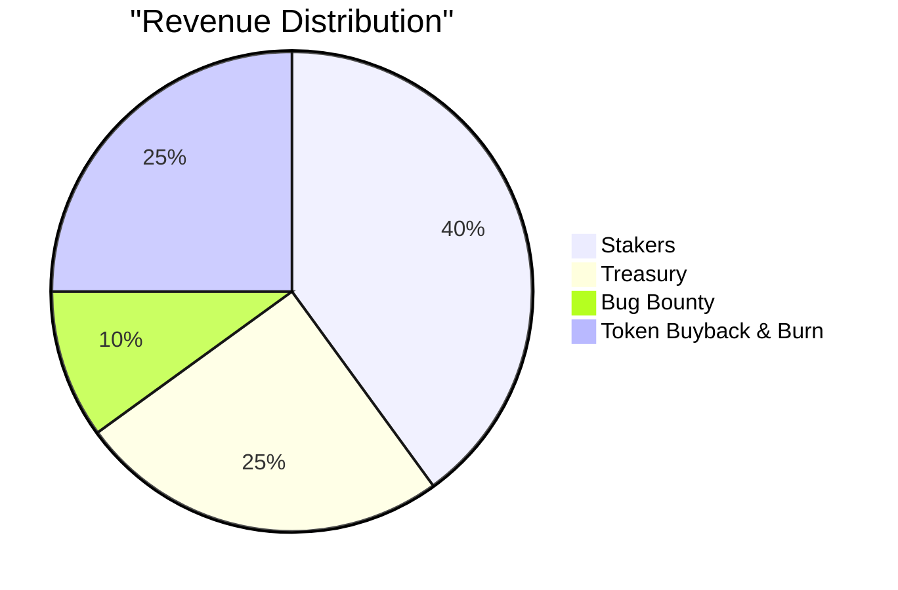

# QUANTANIUM Tokenomics

# The Future of Quantum-Secure Tokenomics

  

### Community-Driven, Utility-Focused, Quantum-Resistant

## Overview

QUANTANIUM (QNTM) is designed as a community-driven, utility-focused token that powers the world's first quantum-resistant Web3 security protocol. Our tokenomics model emphasizes long-term alignment between users, developers, and the protocol's security.

## Beta Users Airdrop Program

<table style="background: linear-gradient(145deg, #1a1a1a, #2a2a2a); border-radius: 10px; width: 600px;">
<tr>
<td align="center" style="padding: 20px;">

### Become a Beta User

🎯 Base Allocation
📈 Usage Bonus
🐛 Bug Bounty

<a href="https://quantanium.xyz/beta" style="display: inline-block; padding: 12px 24px; background: #00ff94; color: #000; text-decoration: none; border-radius: 5px; font-weight: bold; margin: 20px 0;">
CLAIM YOUR AIRDROP
</a>

</td>
</tr>
</table>

The Beta Users Airdrop is designed to reward early adopters who help test, improve, and secure the protocol:

- **Eligibility**: Active participation in the beta testing program
- **Allocation Criteria**:
  - Base allocation: 50% of airdrop
  - Usage-based bonus: 30% of airdrop
  - Bug reporting & feedback: 20% of airdrop
- **Distribution**: Immediate upon mainnet launch
- **Lock-up**: Optional lock-up periods for additional benefits

## Token Distribution

Total Supply: 1,000,000,000,000 QNTM (1 Trillion)

| Allocation | Percentage | Amount | Vesting |
|------------|------------|---------|---------|
| Beta Users Airdrop | 15% | 150,000,000,000 | Immediate |
| Development Fund & Team | 15% | 150,000,000,000 | 3-month linear vesting |
| PumpFun Launch | 70% | 700,000,000,000 | Immediate circulating supply |

## Advantages of Our Model

<table>
<tr>
<td align="center">
🤝   <strong>Aligned Incentives</strong>
</td>
<td align="center">
💰   <strong>Sustainable Economics</strong>
</td>
<td align="center">
👥   <strong>Community First</strong>
</td>
<td align="center">
🛡️   <strong>Security Focused</strong>
</td>
</tr>
</table>

1. **Aligned Incentives**
   - Users are incentivized to stake long-term
   - Developers are rewarded for contributions
   - Community has direct governance input

2. **Sustainable Economics**
   - Fair launch through airdrop
   - No pre-mine or venture capital allocation
   - Revenue sharing with stakeholders

3. **Community First**
   - Open source development
   - Transparent governance
   - Democratic decision-making

4. **Security Focused**
   - Bug bounty program
   - Regular security audits
   - Community-driven security improvements

## Staking Mechanism: Access-for-Stake Model

| Lock Period | Discount on Protocol Usage | Additional Benefits |
|-------------|---------------------------|-------------------|
| 1 month | 20% | Basic quantum security features |
| 6 months | 40% | + Advanced threat detection |
| 1 year | 60% | + Enterprise features |
| 4 years ("Forever") | 90% | Full suite + Priority support |

### Staking Benefits
- Reduced protocol usage costs
- Enhanced security features
- Priority support access
- Governance voting power
- Revenue sharing from protocol fees

## Community Governance

### Voting Power
- 1 QNTM = 1 base vote
- Voting power multipliers based on stake duration:
  - 1-month stake: 1x
  - 6-month stake: 2x
  - 1-year stake: 3x
  - 4-year stake: 5x

### Governance Scope
- Protocol upgrades and features
- Security parameter adjustments
- Treasury fund allocation
- Fee structure modifications
- Partnership decisions

## Protocol Revenue Model

| Allocation | Percentage | Purpose |
|------------|------------|---------|
| Stakers | 40% | Distributed to token stakers |
| Treasury | 25% | Protocol development and maintenance |
| Bug Bounty Fund | 10% | Security improvements and bug fixes |
| Token Buyback & Burn | 25% | Regular buyback and burn to reduce supply |

## Join the Quantum Revolution

<table style="background: linear-gradient(145deg, #1a1a1a, #2a2a2a); border-radius: 10px; width: 600px;">
<tr>
<td align="center" style="padding: 20px;">

### Be Part of Our Community

<a href="https://discord.gg/quantanium">Discord</a>
<a href="https://t.me/quantanium">Telegram</a>
<a href="https://twitter.com/quantanium">Twitter</a>

<a href="https://quantanium.xyz/stake" style="display: inline-block; padding: 12px 24px; background: #00ff94; color: #000; text-decoration: none; border-radius: 5px; font-weight: bold; margin: 20px 0;">
START STAKING NOW
</a>

</td>
</tr>
</table>

---

*"Securing the future of Web3 through quantum-resistant tokenomics and community governance."*

 
