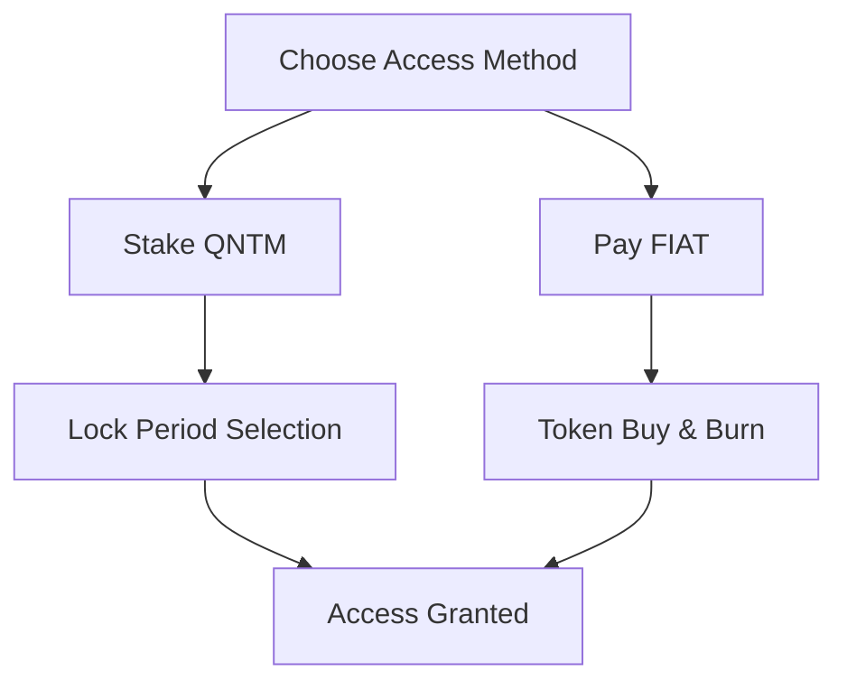
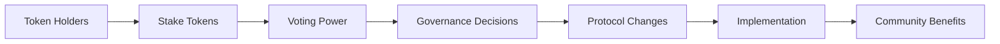
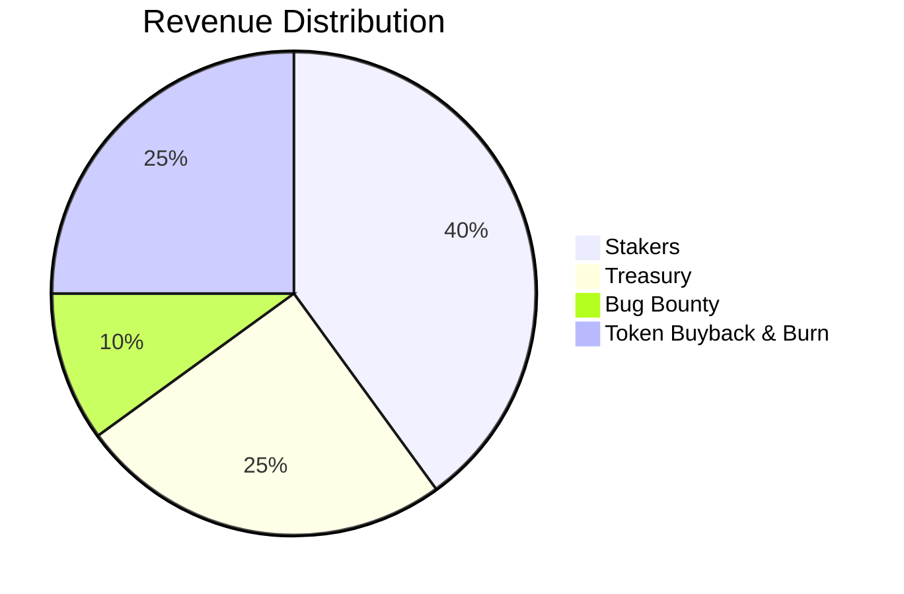

# QUANTANIUM Tokenomics

<div align="center">

[](https://quantanium.xyz)
[](https://quantanium.xyz)
[](https://quantanium.xyz)
[](https://quantanium.xyz)

## Token Information
**Network**: Solana
**Contract Address**: `Launching Soon...`
**Token Symbol**: QNTM
**Explorer**: 'Launching Soon...'

<div align="center">
  
  
# The Future of Quantum-Secure Tokenomics

### Community-Driven, Utility-Focused, Quantum-Resistant

</div>

## Overview

QUANTANIUM (QNTM) is designed as a community-driven, utility-focused token that powers the world's first quantum-resistant Web3 security protocol. Our tokenomics model emphasizes long-term alignment between users, developers, and the protocol's security.

## 🚀 Join the Quantum Security Revolution

## Join the Beta Program

<div align="center">

# BETA ACCESS NOW OPEN

### Be among the first to experience military-grade quantum security

<table align="center" style="background: linear-gradient(145deg, #1a1a1a, #2a2a2a); border-radius: 10px; width: 600px;">
<tr>
<td align="center" style="padding: 20px;">

<div style="display: flex; justify-content: space-between; margin: 20px 0;">
<span>🛡️ Priority Access</span>
<span>🔒 Advanced Features</span>
<span>💎 Enterprise Support</span>
</div>

<a href="https://quantanium.xyz/beta" style="display: inline-block; padding: 12px 24px; background: #00ff94; color: #000; text-decoration: none; border-radius: 5px; font-weight: bold; margin: 20px 0;">

REQUEST BETA ACCESS

</a>

<p style="margin-top: 15px; font-size: 0.9em; color: #888;">We're already protecting over $50M in digital assets within our private Alpha stage. </p>

</td>
</tr>
</table>

</div>

---

## The Beta Airdrop

The Beta Users Airdrop is designed to reward early adopters who help test, improve, and secure the protocol:

- **Eligibility**: Register your wallet & participate in the beta testing program
- **Allocation Criteria**:
  - Base allocation: 50% of airdrop
  - Usage-based bonus: 30% of airdrop
  - Bug reporting & feedback: 20% of airdrop
- **Distribution**: Immediate upon mainnet launch
- **Lock-up**: Optional lock-up periods for additional benefits

## Token Distribution

Total Supply: 1,000,000,000 QNTM (1 Billion)
Airdrop Supply: Up to 15% > 1% per 1,000 Registered Users, with a max of 15,000 Beta Users.

<div align="center">


| Allocation | Percentage | Amount | Vesting |
|------------|------------|---------|---------|
| Beta Users Airdrop | Up To 15% | 150,000,000 | Immediate |
| Development Fund & Team | 15% | 150,000,000 | 3-month linear vesting |
| PumpFun Launch | 70% | 700,000,000 | Immediate circulating supply |
</div>

## Advantages of Our Model

<div align="center">
<table>
<tr>
<td align="center">
🤝 <br/> <strong>Aligned Incentives</strong>
</td>
<td align="center">
💰 <br/> <strong>Sustainable Economics</strong>
</td>
<td align="center">
👥 <br/> <strong>Community First</strong>
</td>
<td align="center">
🛡️ <br/> <strong>Security Focused</strong>
</td>
</tr>
</table>
</div>

1. **Aligned Incentives**
   - Users are incentivized to stake long-term
   - Developers are rewarded for contributions
   - Community has direct governance input

2. **Sustainable Economics**
   - Fair launch through airdrop
   - No pre-mine or venture capital allocation
   - Revenue sharing with stakeholders

3. **Community First**
   - Open source development
   - Transparent governance
   - Democratic decision-making

4. **Security Focused**
   - Bug bounty program
   - Regular security audits
   - Community-driven security improvements

## Access Model: Stake-to-Use or Pay-as-you-Go

Our flexible access model allows users to either stake QNTM tokens for discounted access or pay with FIAT. When using FIAT, 100% of the payment is used to buy and burn QNTM tokens, reducing total supply.

<div align="center">



### Monthly Subscription Tiers

| Tier | FIAT Price | Required Stake* | Lock Period Options | Effective Discount** |
|-------------|-------------|-------------------|-------------------|-------------------|
| Basic | $99/mo | $2,000 in QNTM | 6 months min | 50% |
| Advanced | $299/mo | $5,000 in QNTM | 6 months min | 55% |
| Pro | $999/mo | $15,000 in QNTM | 12 months min | 60% |
| Enterprise | $2,999/mo | $40,000 in QNTM | 12 months min | 65% |

</div>

\* Required stake is calculated in USD value of QNTM tokens and automatically adjusts with market price
\** Discount represents the cost savings compared to monthly FIAT payments when staking for the minimum period

### How It Works

1. **FIAT Payment Route**:
   - Subscribe with traditional monthly payments
   - 100% of FIAT payments are used to buy & burn QNTM tokens
   - Immediate access to tier features
   - Cancel anytime

2. **Token Staking Route**:
   - Stake the required USD value in QNTM tokens
   - Longer stake periods = Higher benefits
   - Maintain exit liquidity
   - Earn additional rewards through revenue sharing

### Dynamic Staking Formula
```
Required Stake = (Monthly FIAT Price × 12 × (1 - Tier Discount)) ÷ Revenue Share APY
```
Example for Pro Tier:
- FIAT Price: $999/mo
- Tier Discount: 60%
- Revenue Share APY: 15%
- Required Stake = ($999 × 12 × 0.4) ÷ 0.15 = $31,968 ≈ $15,000 min stake

### Staking Benefits by Tier

- **Basic Tier** ($99/mo or stake equivalent)
  - Essential quantum security features
  - Basic support access
  - 1x voting power
  - 10% APY from revenue sharing

- **Advanced Tier** ($299/mo or stake equivalent)
  - All Basic features
  - Advanced threat detection
  - Priority queue for support
  - 2x voting power
  - 12% APY from revenue sharing
  - Early access to beta features

- **Pro Tier** ($999/mo or stake equivalent)
  - All Advanced features
  - Enterprise-grade security
  - Dedicated support line
  - 3x voting power
  - 15% APY from revenue sharing
  - Feature request prioritization

- **Enterprise Tier** ($2,999/mo or stake equivalent)
  - All Pro features
  - Custom security solutions
  - 24/7 priority support
  - 5x voting power
  - 20% APY from revenue sharing
  - Direct access to development team
  - Custom integration support

### Token Burn Mechanism

When users choose FIAT payments:
1. 100% of the payment is used to purchase QNTM tokens from the market
2. Purchased tokens are immediately burned
3. This creates constant buy pressure and reduces total supply
4. Token burns are publicly verifiable on-chain
5. Those with staked tokens have the potential of exit liquidity, essentially accessing the product for an opportunity cost

### Staking Flexibility

- **Minimum Lock Periods**: 3, 6 or 12 months depending on tier
- **Extended Locks**: Additional benefits for longer commitments
- **Early Withdrawal**: Available with 20% penalty fee
- **Stake Adjustments**: 
  - Increase stake anytime
  - Decrease stake after lock period
  - Automatic tier upgrades when adding more tokens

## Community Governance

<div align="center">


</div>

### Voting Power
- 1 QNTM = 1 base vote
- Voting power multipliers based on stake duration:
  - 1-month stake: 1x
  - 6-month stake: 2x
  - 1-year stake: 3x
  - 4-year stake: 5x

### Governance Scope
- Protocol upgrades and features
- Security parameter adjustments
- Treasury fund allocation
- Fee structure modifications
- Partnership decisions

## Protocol Revenue Model

<div align="center">



| Allocation | Percentage | Purpose |
|------------|------------|---------|
| Stakers | 40% | Distributed to token stakers based on tier |
| Treasury | 25% | Protocol development and maintenance |
| Bug Bounty Fund | 10% | Security improvements and bug fixes |
| Token Buyback & Burn | 25% | Regular buyback and burn to reduce supply |
</div>

## Join the Quantum Revolution

<div align="center">
<table style="background: linear-gradient(145deg, #1a1a1a, #2a2a2a); border-radius: 10px; width: 600px;">
<tr>
<td align="center" style="padding: 20px;">

### Be Part of Our Community

<div style="display: flex; justify-content: space-between; margin: 20px 0;">
<a href="https://discord.gg/quantanium">Website</a>
<a href="https://t.me/quantanium">Telegram</a>
<a href="https://twitter.com/quantanium">Twitter</a>
</div>

<a href="https://quantanium.xyz/stake" style="display: inline-block; padding: 12px 24px; background: #00ff94; color: #000; text-decoration: none; border-radius: 5px; font-weight: bold; margin: 20px 0;">
JOIN THE BETA NOW
</a>

</td>
</tr>
</table>

---

*"Securing the future of Web3 through quantum-resistant tokenomics and community governance."*
</div>
